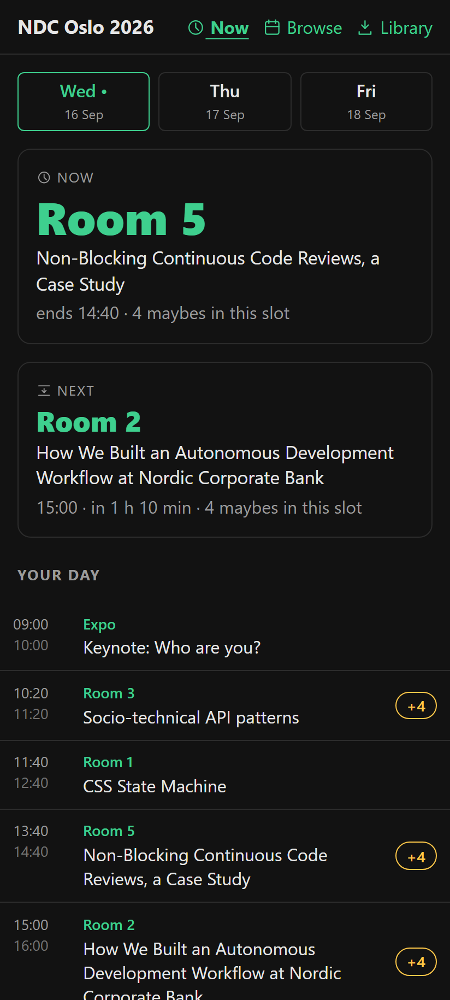
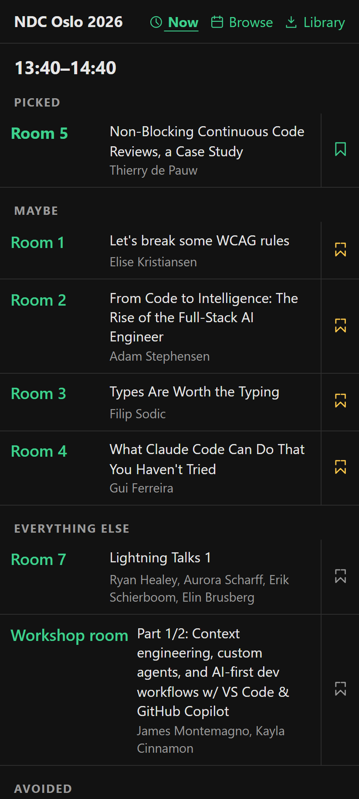
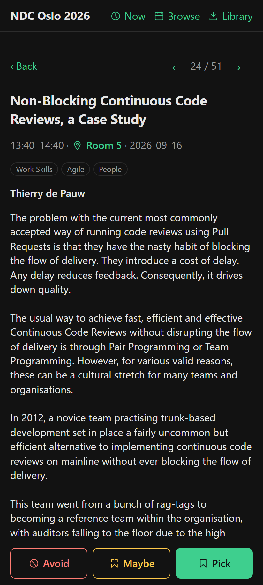
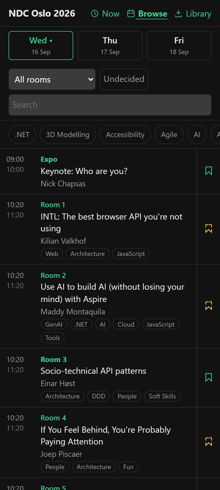
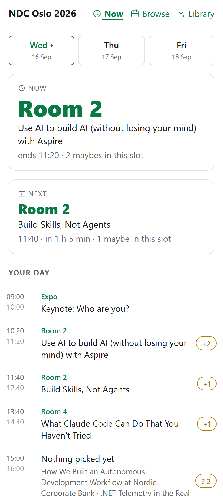

# setlist

A conference companion PWA optimised for one question: **where do I go next?**

**➡ Open the app: <https://bjornkpu.github.io/setlist/app/>** (keep the
trailing slash — links without it break offline). Load any schedule with
`…/app/?url=<schedule.json url>`.

<p>
  
  
  
</p>

## What it does

Conference programs are built for browsing before the event. setlist is built
for the stairwell with four minutes left: you mark a **pick** per time slot
(plus unordered **maybes** and **avoids**), and the glance view shows the room
you need — room name largest on screen, updating as time passes, fully
offline.

- **Glance** (`Now`): the room to walk to right now, what's next, and your
  whole day below — picks, keynotes/lunch, and a "Nothing picked yet" row for
  slots you left contested. The `+N` badge counts maybes competing in that
  slot. Swipe sideways for other days.
- **Slot view**: tap any card to see everything running in that time range,
  grouped Picked / Maybe / Everything else / Avoided — for when your pick's
  room is full and you need plan B now.
- **Browse**: the full program with day tabs, room filter, topic chips,
  search, and an **Undecided** toggle that hides everything you've already
  marked. Swipe a row right to pick, left to avoid; the button toggles maybe.
- **Audit flow**: open a session, read the abstract, hit a colored button —
  it saves and slides to the next session in your filtered queue. Swipe
  sideways for previous/next. Deciding a three-day program takes minutes.
- One pick per overlapping time range: picking a session demotes a
  conflicting pick to maybe, with an Undo toast.
- Installable PWA, works offline, dark and light theme, no accounts, no
  tracking, no build step — plain HTML/CSS/JS.

 

## Bring your own conference

setlist has no backend. A schedule is one **frab-compatible `schedule.json`**
(the format used by CCC/pretalx tooling and Skedz — links are
interchangeable) served from any static host that allows CORS:

```
…/app/?url=https://example.com/my-conference/schedule.json
```

That link is the whole integration. For testing, `&at=2026-09-17T12:00:00%2B02:00`
freezes the clock at any instant of the conference.

### Making a schedule.json

1. **From a source with stable ids** (Sessionize, frab/pretalx upstream):
   ```
   uv run python tools/sessionize_to_frab.py <sessionize.json> --title "…" --acronym <acr> --offset +02:00 --tz-name Europe/Oslo --out conferences/<name>.json
   ```
2. **From a scraped program** (PDF, web page): use `tools/EXTRACTION_PROMPT.md`
   with an LLM, then hand-correct.
3. **Validate** (must report 0 errors; read every warning):
   ```
   uv run python tools/validate.py conferences/<name>.json
   ```

**Guid rules are per-conference and immutable** — see the "Guid identity"
section of `tools/EXTRACTION_PROMPT.md`. Event guids are the keys users'
plans are stored under: switching the guid recipe on a re-extraction
regenerates every guid and silently destroys everyone's plan.

### Hosting a provider

A **provider** is just a directory with the schedules plus a generated
`index.json`; the app's Library lists a provider's conferences, split into
upcoming and past. This repo's `conferences/` directory, served by GitHub
Pages, is the default provider. To host your own:

1. Put your `schedule.json` files in a directory.
2. Generate the index:
   ```
   uv run python tools/gen_index.py <directory>
   ```
3. Serve the directory statically (GitHub Pages works fine) and add its URL
   under Library → Providers in the app.

Adding a conference to *this* repo is the same flow: convert → validate →
`uv run python tools/gen_index.py conferences` → commit the schedule and
`conferences/index.json` together → push (Pages deploys on push).

## Development

```text
app/           the PWA — no build step, no dependencies
conferences/   frab-compatible schedules + generated index.json (the default provider)
tools/         validator, index generator, Sessionize converter, extraction prompt, screenshot tool
tests/         node:test suites for the app's pure logic
```

Run locally with any static server from the repo root, then open `/app/`
(the service worker needs HTTP; `file://` won't work):

```
python -m http.server 8123
```

→ <http://localhost:8123/app/?url=/conferences/fagfestival-2026.json>

Tests — CI runs both suites on every push:

```
node --test tests/
python -m unittest discover -s tools -v
```

Three of these are load-bearing guards, not unit tests:

- `tests/sw.test.js` content-hashes the app shell and asserts it matches
  `VERSION` in `app/sw.js` — editing shell files without bumping `VERSION`
  would strand installed apps on a stale cache (the failure prints the string
  to paste).
- `tools/test_gen_index.py` asserts the committed `conferences/index.json`
  matches what `gen_index.py` generates.
- `tests/icons.test.js` asserts the inline icons in `app/js/icons.js` match
  the svg files in `app/assets/icons/`.

README screenshots are reproducible:
`node tools/screenshot.mjs <app url> out.png --dark --init tools/demo-plan.js --hash "#/browse"`
(headless Edge; the demo plan seeds realistic picks).

## Licence

AGPL-3.0 — see [LICENSE](LICENSE).
